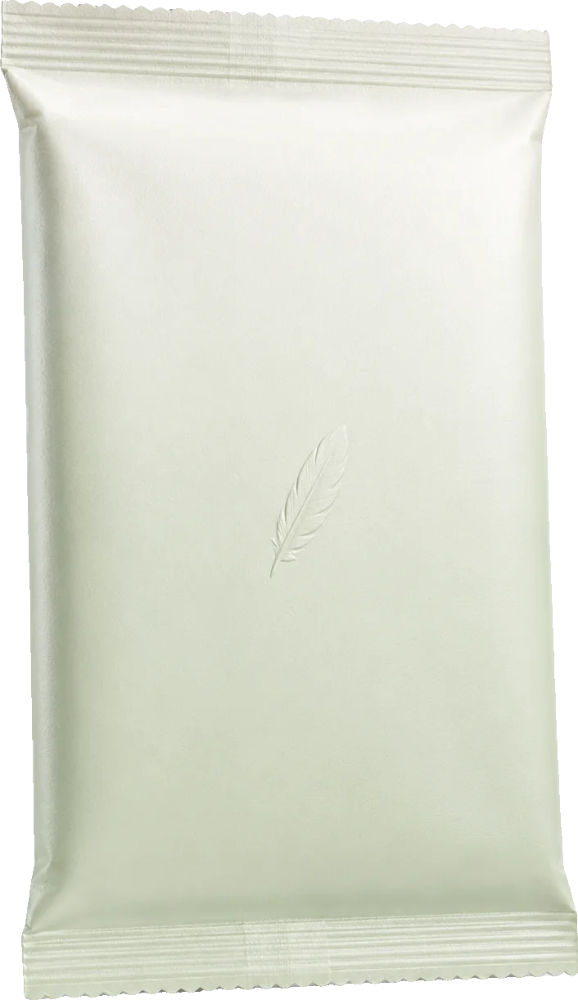
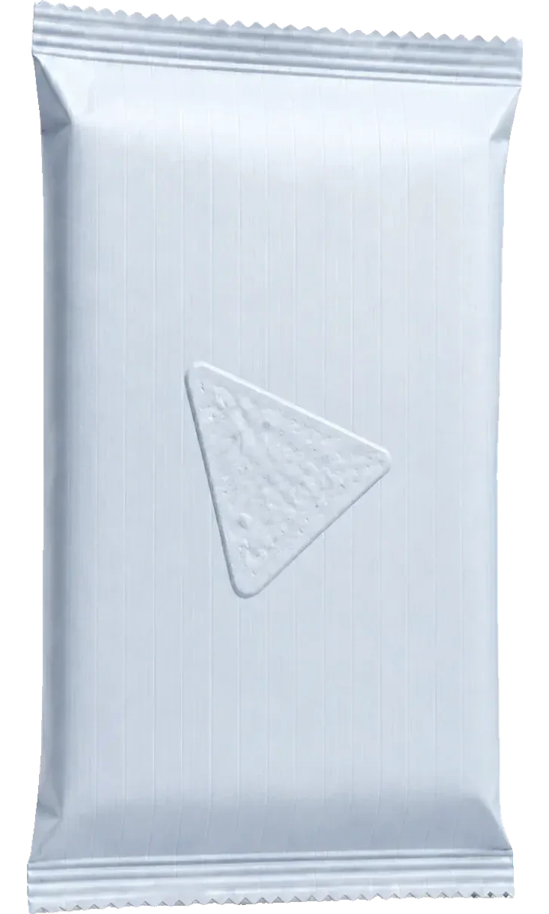
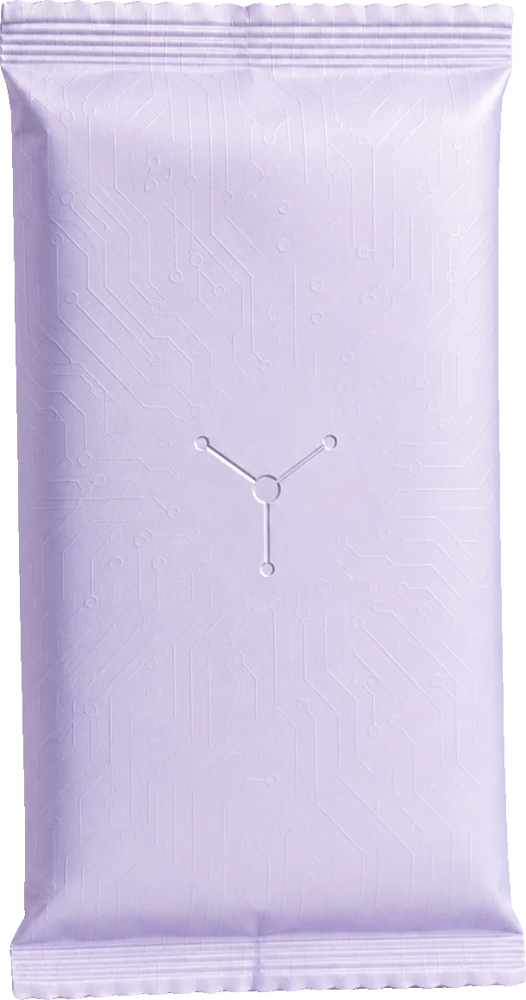
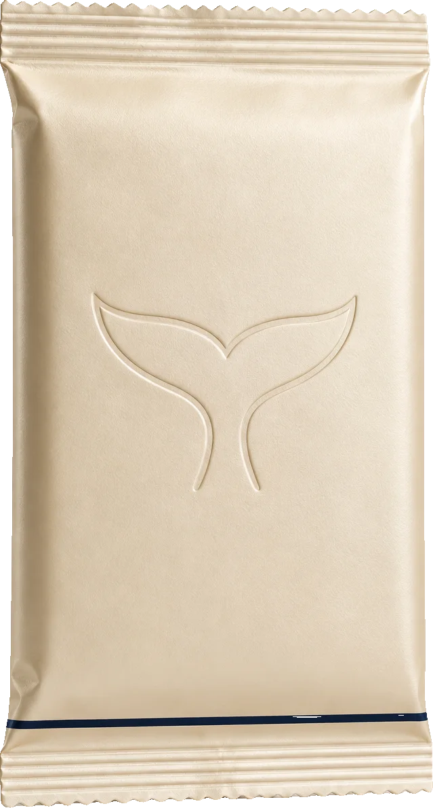

<div align="center">


# finch

### Open a pack. Own real stocks.

Randomized packs of tokenized equities, bought on-chain at settlement and delivered
straight to your wallet. No inventory, no custody, no refunds — every card is a real stock.






<sub>Starter · Blue Chip · AI · Whale</sub>

[](https://robinhoodchain.blockscout.com)
[](contracts/)
[](https://getfoundry.sh)
[](src/)
[](https://docs.uniswap.org)
[](https://docs.chain.link)
[](#security)
[](LICENSE)

**[finch.fun](https://finch.fun)** · **[Docs](https://finch.fun/#/docs)** · **[Contracts on Blockscout](https://robinhoodchain.blockscout.com/address/0x933C7F2F72e8FD5b57afB7a9Ee1ad36Fc5a6D45c)**

</div>

---

```
$10 USDG in  →  $7.90 buys your stock  ·  $2.00 shared jackpot  ·  $0.10 protocol
```

Card value is rolled on-chain and randomized inside its rarity band, so a $10 pack
settles at an uneven number like **$8.43** — never a flat multiple.

---

## How it works

```
        buy                                    open  (keeper, ~2s later)
         │                                       │
    USDG or ETH                          blockhash(commitBlock)
         │                                       │
         ▼                                       ▼
   ┌───────────┐   20%   ┌─────────────┐    rarity roll ──► card value
   │ PackSale  ├────────►│ JackpotVault│         │
   │           │   1%    └──────┬──────┘         ▼
   │           ├────────► treasury      swap USDG ──► Uniswap v4
   └─────┬─────┘                                 │
         │                              minOut from Chainlink
         │  79% held as the card budget          │
         └───────────────────────────────────────┴──► stock to buyer
```

1. **Buy** — pay in USDG or native ETH. One signature. The jackpot cut and protocol
   fee split off immediately; the rest is your card budget.
2. **Commit** — your outcome locks to a future block hash. Nobody, including us, can
   see or influence it.
3. **Settle** — a permissionless keeper calls `open()` a couple of seconds later. The
   contract rolls rarity, buys that much stock on Uniswap v4, and transfers it to you.

## Features

| | |
|---|---|
| **Commit–reveal randomness** | Outcome binds to a future block hash. No re-rolls, no cherry-picking — `open()` is permissionless so waiting gains you nothing. |
| **Just-in-time settlement** | Cards are bought at open time on Uniswap v4. The protocol holds no stock inventory. |
| **Oracle-guarded swaps** | Every swap's minimum output comes from the stock's Chainlink feed. A thin or manipulated pool is rejected and the next stock is tried. |
| **No refund path** | Every card is a real stock. Nothing settles to cash. |
| **Solvency by construction** | Each unsettled pack reserves 3× its price. A pack that cannot be settled cannot be sold. |
| **One-signature UX** | A keeper settles for the buyer. They sign once and the card arrives. |
| **Shared jackpot** | 20% of every sale accrues on-chain. Hidden cards (1%) pay a slice of it instantly. |
| **Real equities** | Official Robinhood Stock Tokens only, verified against the on-chain registry. |

## Odds

Rarity picks a band; the value lands anywhere inside it. Both are hardcoded in
[`PackSaleCore.sol`](contracts/src/PackSaleCore.sol) — read them yourself.

| Rarity | Odds | Card value |
|---|---|---|
| Common | 78% | 0.60× – 0.85× pack price |
| Rare | 15% | 0.85× – 1.20× |
| Epic | 5% | 1.20× – 1.80× |
| Legendary | 2% | 1.80× – 3.00× |
| **Hidden card** | **1%** | **0.5% – 25% of the jackpot vault, paid in USDG** |

finch is entertainment with real assets attached — the expected value of a pack is
less than what you pay for it.

## Contracts

Robinhood Chain · chain ID **4663**

All five finch contracts are source-verified on Blockscout.

| Contract | Address | |
|---|---|---|
| `PackSaleCore` | [`0x933C7F2F72e8FD5b57afB7a9Ee1ad36Fc5a6D45c`](https://robinhoodchain.blockscout.com/address/0x933C7F2F72e8FD5b57afB7a9Ee1ad36Fc5a6D45c) | ✅ verified |
| `CommitRevealRandomness` | [`0x731fCC2FCd8DaD81e8d6c11b84F05701CAdd9CC8`](https://robinhoodchain.blockscout.com/address/0x731fCC2FCd8DaD81e8d6c11b84F05701CAdd9CC8) | ✅ verified |
| `UniswapV4Adapter` | [`0x76dfFEfec7302D548D8D53b299e051460CD87907`](https://robinhoodchain.blockscout.com/address/0x76dfFEfec7302D548D8D53b299e051460CD87907) | ✅ verified |
| `JackpotVault` | [`0xe7353a598229d1ce4c8ac15E731c380D92dfb137`](https://robinhoodchain.blockscout.com/address/0xe7353a598229d1ce4c8ac15E731c380D92dfb137) | ✅ verified |
| `Swapper` | [`0x8b959dB2bd9835DFD8a575E3cb696Fcab7Dbd8Dd`](https://robinhoodchain.blockscout.com/address/0x8b959dB2bd9835DFD8a575E3cb696Fcab7Dbd8Dd) | ✅ verified |
| Treasury | [`0xd589cF06C304e91BEc4432278e9E852914631733`](https://robinhoodchain.blockscout.com/address/0xd589cF06C304e91BEc4432278e9E852914631733) | |
| `USDG` (payment) | [`0x5fc5360D0400a0Fd4f2af552ADD042D716F1d168`](https://robinhoodchain.blockscout.com/address/0x5fc5360D0400a0Fd4f2af552ADD042D716F1d168) | Paxos |
| Uniswap v4 `PoolManager` | [`0x8366a39CC670B4001A1121B8F6A443A643e40951`](https://robinhoodchain.blockscout.com/address/0x8366a39CC670B4001A1121B8F6A443A643e40951) | |

### $FINCH

| | |
|---|---|
| Token | [`0x81eb5f0f49a077d82a2421037ddb1710d8153772`](https://robinhoodchain.blockscout.com/token/0x81eb5f0f49a077d82a2421037ddb1710d8153772) |
| Supply | 1,000,000,000 · 18 decimals |

Creator fees from the token spill into the jackpot vault.

> ⚠️ Verify addresses against this file and the in-app docs. There are tokens on this
> chain using real tickers at fake addresses — a matching symbol is not proof of anything.

## Repository

```
contracts/        Solidity (Foundry)
  src/            PackSaleCore, CommitRevealRandomness,
                  UniswapV4Adapter, JackpotVault, Swapper
  script/         deploy scripts (mainnet, testnet)
  test/           unit + forked-mainnet tests
src/              React + Vite frontend, wagmi/viem
  components/     packs, reveal cinema, wallet, docs
scripts/          keeper, treasury manager, art + airdrop tooling
```

## Running it

```bash
npm install
npm run dev                 # frontend at localhost:5173

cd contracts
forge test                  # unit tests
forge test --fork-url https://rpc.mainnet.chain.robinhood.com   # against live pools
```

Deploy and operations are documented in [LAUNCH.md](LAUNCH.md).

```bash
node scripts/round.mjs status      # jackpot, volume, capacity
node scripts/treasury.mjs status   # full money map
node scripts/keeper.mjs            # settle packs for buyers
```

## Roadmap

| | Status |
|---|---|
| Swap-at-settlement, no inventory | ✅ Live |
| USDG and native ETH payment | ✅ Live |
| One-signature buying via keeper | ✅ Live |
| Oracle-guarded swap minimums | ✅ Live |
| Automated treasury recycling | ✅ Live |
| $FINCH token + creator-fee recycling | ✅ Live |
| Chainlink VRF when available on 4663 | 📋 Planned |
| Collection completion rewards | 📋 Planned |

## Security

Pre-audit. The contracts are unaudited and should be treated as experimental software.

Randomness is commit–reveal on a future block hash — appropriate for the stakes involved,
but not VRF. It will move to Chainlink VRF when that lands on Robinhood Chain.

Robinhood Stock Tokens are issued and controlled by Robinhood: upgradeable, pausable, and
not offered to U.S. or U.K. persons. Chainlink equity feeds run 24/5 and pause during
corporate actions; openings revert rather than settle on a stale price.

Found something? Open an issue or disclose privately — responsible disclosure appreciated.

## Disclaimer

Not investment advice. Packs are randomized and the expected value of a pack is below its
price. Tokenized equities carry market risk. Do not spend more than you are willing to lose.

## License

MIT
